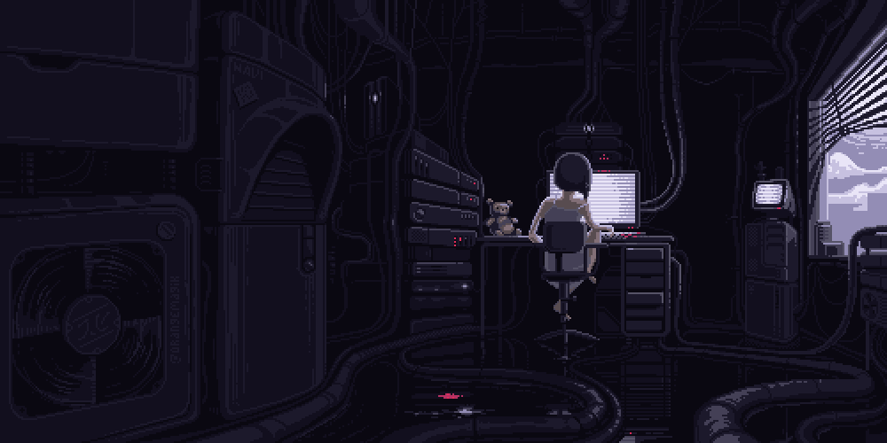

<!-- 🌊 Top Wave -->

  

<!-- 🌸 Cute Header -->

# ✨ 𝒉𝒊! 𝒊'𝒎 **𝒓𝒂𝒆𝒔𝒕𝒕𝒍𝒆𝒕𝒆𝒏** ✨  

---

## -`♡´- About me  
🤍 I’m passionate about **programming and design**.  
🐾 I love expressing my personality and leaving my unique mark in every project with a special touch.  
👩🏼‍💻 I’m constantly learning and exploring new technologies to grow as a developer.   

⋆⭒˚.⋆ ✨⋆⭒˚.⋆

--- 

<!-- Languages -->

<!-- Tools -->

--- 

  

---  

  

 *dev in progress... 𖹭.ᐟ*   

---

  

