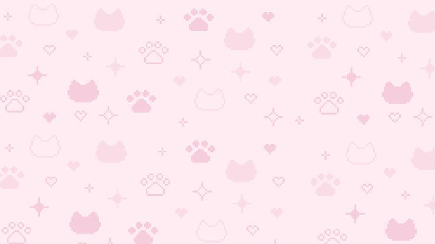

<!-- 🌸 Encabezado bonito -->

# ✨🍓 𝒉𝒊! 𝒊'𝒎 **𝒓𝒂𝒆𝒔𝒕𝒕𝒍𝒆𝒕𝒆𝒏** 🍓✨  
  

---

## 🎀 Sobre mí  
🍓 Me encanta programar con un estilo creativo y tierno.  
💻 Siempre aprendiendo y creando cosas nuevas.  
🌸 Fan del diseño colorido, los gifs y las decoraciones kawaii.  

---

## 💖 Tecnologías y lenguajes que uso  

<!-- Lenguajes -->

<!-- Herramientas -->

---

## 🌸 Un poco de estética  

  

🌷 *Coding with sparkles and love!* 🌷  

---

<!-- 🌸 Footer -->

  

